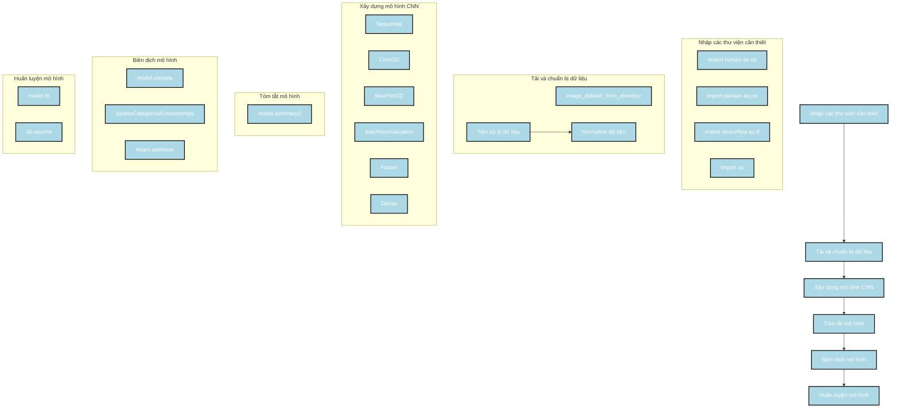

Dưới đây là phân tích về cách xây dựng mô hình của tác giả và các bước thực hiện, sau đó là sơ đồ Mermaid để mô tả quá trình này.

### Các bước thực hiện

1. **Nhập các thư viện cần thiết**:
   - Import các thư viện cần thiết như `numpy`, `pandas`, `tensorflow`, và `os`.

2. **Tải và chuẩn bị dữ liệu**:
   - Sử dụng `image_dataset_from_directory` để tải dữ liệu từ thư mục chứa hình ảnh.
   - Tiền xử lý dữ liệu bằng cách chuẩn hóa (normalize) giá trị pixel.

3. **Xây dựng mô hình CNN**:
   - Sử dụng `Sequential` để xây dựng mô hình CNN với các lớp `Conv2D`, `MaxPool2D`, `BatchNormalization`, `Flatten`, và `Dense`.

4. **Tóm tắt mô hình**:
   - Hiển thị cấu trúc mô hình bằng phương thức `model.summary()`.

5. **Biên dịch mô hình**:
   - Sử dụng `model.compile` với hàm mất mát `SparseCategoricalCrossentropy` và bộ tối ưu `Adam`.

6. **Huấn luyện mô hình**:
   - Sử dụng `model.fit` để huấn luyện mô hình trên tập dữ liệu trong 40 epochs.

### Sơ đồ Mermaid

### Mô tả sơ đồ

1. **Nhập các thư viện cần thiết**:
   - Nhập các thư viện cần thiết như `numpy`, `pandas`, `tensorflow`, và `os`.

2. **Tải và chuẩn bị dữ liệu**:
   - Sử dụng `image_dataset_from_directory` để tải dữ liệu từ thư mục chứa hình ảnh.
   - Tiền xử lý dữ liệu bằng cách chuẩn hóa giá trị pixel.

3. **Xây dựng mô hình CNN**:
   - Sử dụng `Sequential` để xây dựng mô hình CNN với các lớp `Conv2D`, `MaxPool2D`, `BatchNormalization`, `Flatten`, và `Dense`.

4. **Tóm tắt mô hình**:
   - Hiển thị cấu trúc mô hình bằng phương thức `model.summary()`.

5. **Biên dịch mô hình**:
   - Sử dụng `model.compile` với hàm mất mát `SparseCategoricalCrossentropy` và bộ tối ưu `Adam`.

6. **Huấn luyện mô hình**:
   - Sử dụng `model.fit` để huấn luyện mô hình trên tập dữ liệu trong 40 epochs.

Sơ đồ này mô tả chi tiết các bước trong quá trình xây dựng và huấn luyện mô hình CNN của tác giả, giúp bạn dễ dàng theo dõi và hiểu được quy trình thực hiện.