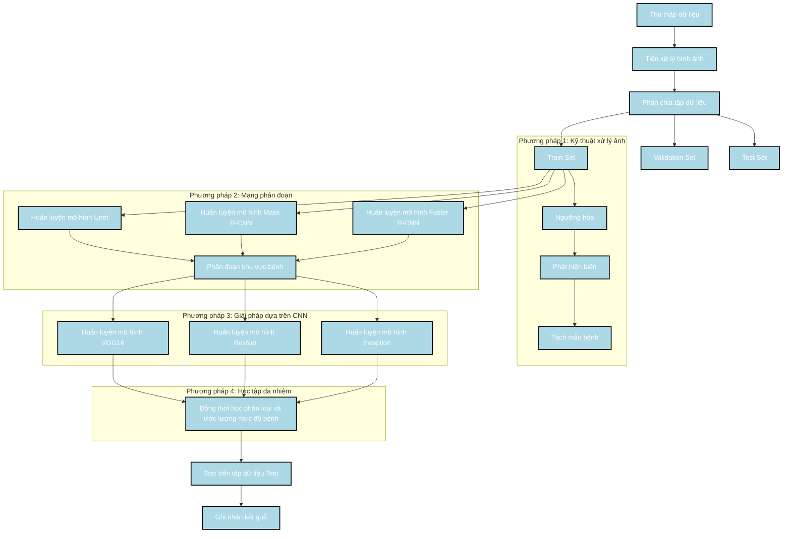

### Phương pháp phát hiện và phân loại bệnh

1. **Giải pháp dựa trên CNN (Convolutional Neural Networks)**:
   - Các tác giả sử dụng Mạng nơ-ron tích chập (CNN) để chẩn đoán và ước lượng mức độ nghiêm trọng của bốn loại bệnh trên quả xoài: thán thư, Alternaria, mốc đen và thối cuống.
   - Các kiến trúc CNN khác nhau như VGG16, ResNet và Inception được thử nghiệm để cải thiện độ chính xác của việc phát hiện bệnh.

2. **Kỹ thuật xử lý ảnh (Image Processing Techniques - IPT)**:
   - Kỹ thuật xử lý ảnh được sử dụng để tiền xử lý hình ảnh, cải thiện chất lượng ảnh để phân đoạn và trích xuất đặc trưng tốt hơn.
   - Các kỹ thuật như ngưỡng hóa và phát hiện biên được áp dụng để tách biệt các mẫu bệnh trên quả xoài.

3. **Mạng phân đoạn (Segmentation Networks)**:
   - Để xác định chính xác vị trí và định lượng mức độ nghiêm trọng của bệnh, các mạng phân đoạn dựa trên CNN như Unet, Mask R-CNN và Faster R-CNN được sử dụng.
   - Các mạng này phân đoạn các khu vực bị nhiễm bệnh trên quả xoài để đánh giá mức độ nghiêm trọng của bệnh.

4. **Học tập đa nhiệm (Multi-task Learning)**:
   - Phương pháp học tập đa nhiệm được áp dụng để đồng thời học các nhiệm vụ phân loại bệnh và ước lượng mức độ nghiêm trọng của bệnh, giảm thiểu hiện tượng overfitting và cải thiện khả năng tổng quát của mô hình.

### Tóm tắt các phương pháp sử dụng

| Phương pháp                    | Mô tả                                                                                                    |
|--------------------------------|----------------------------------------------------------------------------------------------------------|
| Giải pháp dựa trên CNN         | Sử dụng các kiến trúc CNN khác nhau để phát hiện và ước lượng mức độ nghiêm trọng của bệnh.             |
| Kỹ thuật xử lý ảnh             | Áp dụng các kỹ thuật như ngưỡng hóa và phát hiện biên để tiền xử lý hình ảnh và tách biệt các mẫu bệnh. |
| Mạng phân đoạn                 | Sử dụng Unet, Mask R-CNN và Faster R-CNN để phân đoạn các khu vực bị nhiễm bệnh và đánh giá mức độ nghiêm trọng. |
| Học tập đa nhiệm               | Đồng thời học các nhiệm vụ phân loại bệnh và ước lượng mức độ nghiêm trọng, cải thiện độ chính xác và khả năng tổng quát của mô hình. |

Các phương pháp trên cho thấy độ chính xác và hiệu quả cao trong việc phát hiện và phân loại bệnh trên quả xoài, mang lại kết quả hứa hẹn cho các ứng dụng thực tiễn trong quản lý bệnh nông nghiệp. Việc sử dụng các kiến trúc CNN tiên tiến và các kỹ thuật phân đoạn đã cung cấp những đánh giá chi tiết và đáng tin cậy về mức độ nghiêm trọng của bệnh, rất quan trọng để kiểm soát bệnh kịp thời và hiệu quả.

Dưới đây là sơ đồ Mermaid mô tả các bước thực hiện của các kỹ thuật được sử dụng trong bài báo:

Sơ đồ này mô tả các bước thực hiện của các kỹ thuật được sử dụng trong bài báo, bao gồm:

1. **Thu thập dữ liệu**: Thu thập dữ liệu hình ảnh của quả xoài.
2. **Tiền xử lý hình ảnh**: Sử dụng các kỹ thuật ngưỡng hóa và phát hiện biên để tiền xử lý hình ảnh và tách mẫu bệnh.
3. **Phân chia tập dữ liệu**: Chia dữ liệu thành các tập huấn luyện, kiểm tra và kiểm định.
4. **Kỹ thuật xử lý ảnh**: Áp dụng các kỹ thuật ngưỡng hóa và phát hiện biên để tách mẫu bệnh.
5. **Mạng phân đoạn**: Huấn luyện các mô hình Unet, Mask R-CNN và Faster R-CNN để phân đoạn khu vực bệnh.
6. **Giải pháp dựa trên CNN**: Huấn luyện các mô hình VGG16, ResNet và Inception để phân loại và ước lượng mức độ bệnh.
7. **Học tập đa nhiệm**: Đồng thời học các nhiệm vụ phân loại bệnh và ước lượng mức độ nghiêm trọng của bệnh.
8. **Thực nghiệm và ghi nhận kết quả**: Thực nghiệm trên tập dữ liệu kiểm tra và ghi nhận kết quả.

Các bước này được liên kết một cách tuần tự và logic để dễ dàng theo dõi và triển khai.