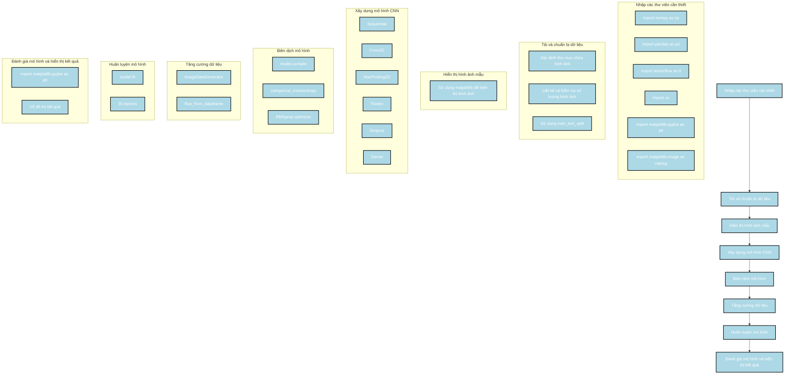

Dưới đây là cách xây dựng mô hình của tác giả từ đoạn code được cung cấp, kèm theo sơ đồ Mermaid mô tả các bước thực hiện:

### Các bước thực hiện

1. **Nhập các thư viện cần thiết**:
   - Import các thư viện cần thiết như `numpy`, `pandas`, `tensorflow`, `os`, và `matplotlib`.

2. **Tải và chuẩn bị dữ liệu**:
   - Xác định các thư mục chứa hình ảnh của các loại bệnh khác nhau.
   - Liệt kê và kiểm tra số lượng hình ảnh trong mỗi thư mục.
   - Sử dụng `train_test_split` để chia dữ liệu thành tập huấn luyện và tập kiểm tra.

3. **Hiển thị hình ảnh mẫu**:
   - Sử dụng `matplotlib` để hiển thị một số hình ảnh mẫu từ các tập dữ liệu.

4. **Xây dựng mô hình CNN**:
   - Sử dụng `Sequential` để xây dựng mô hình CNN với các lớp `Conv2D`, `MaxPooling2D`, `Flatten`, `Dropout`, và `Dense`.

5. **Biên dịch mô hình**:
   - Sử dụng `model.compile` với hàm mất mát `categorical_crossentropy` và bộ tối ưu `RMSprop`.

6. **Tăng cường dữ liệu**:
   - Sử dụng `ImageDataGenerator` để tăng cường dữ liệu cho tập huấn luyện và tập kiểm tra.

7. **Huấn luyện mô hình**:
   - Sử dụng `model.fit` để huấn luyện mô hình trên tập dữ liệu trong 30 epochs.

8. **Đánh giá mô hình và hiển thị kết quả**:
   - Sử dụng `matplotlib` để vẽ đồ thị kết quả huấn luyện và kiểm tra.

### Sơ đồ Mermaid

### Mô tả sơ đồ

1. **Nhập các thư viện cần thiết**:
   - Nhập các thư viện cần thiết như `numpy`, `pandas`, `tensorflow`, `os`, và `matplotlib`.

2. **Tải và chuẩn bị dữ liệu**:
   - Xác định các thư mục chứa hình ảnh của các loại bệnh khác nhau.
   - Liệt kê và kiểm tra số lượng hình ảnh trong mỗi thư mục.
   - Sử dụng `train_test_split` để chia dữ liệu thành tập huấn luyện và tập kiểm tra.

3. **Hiển thị hình ảnh mẫu**:
   - Sử dụng `matplotlib` để hiển thị một số hình ảnh mẫu từ các tập dữ liệu.

4. **Xây dựng mô hình CNN**:
   - Sử dụng `Sequential` để xây dựng mô hình CNN với các lớp `Conv2D`, `MaxPooling2D`, `Flatten`, `Dropout`, và `Dense`.

5. **Biên dịch mô hình**:
   - Sử dụng `model.compile` với hàm mất mát `categorical_crossentropy` và bộ tối ưu `RMSprop`.

6. **Tăng cường dữ liệu**:
   - Sử dụng `ImageDataGenerator` để tăng cường dữ liệu cho tập huấn luyện và tập kiểm tra.

7. **Huấn luyện mô hình**:
   - Sử dụng `model.fit` để huấn luyện mô hình trên tập dữ liệu trong 30 epochs.

8. **Đánh giá mô hình và hiển thị kết quả**:
   - Sử dụng `matplotlib` để vẽ đồ thị kết quả huấn luyện và kiểm tra.

Sơ đồ này mô tả chi tiết các bước trong quá trình xây dựng và huấn luyện mô hình CNN của tác giả, giúp bạn dễ dàng theo dõi và hiểu được quy trình thực hiện.