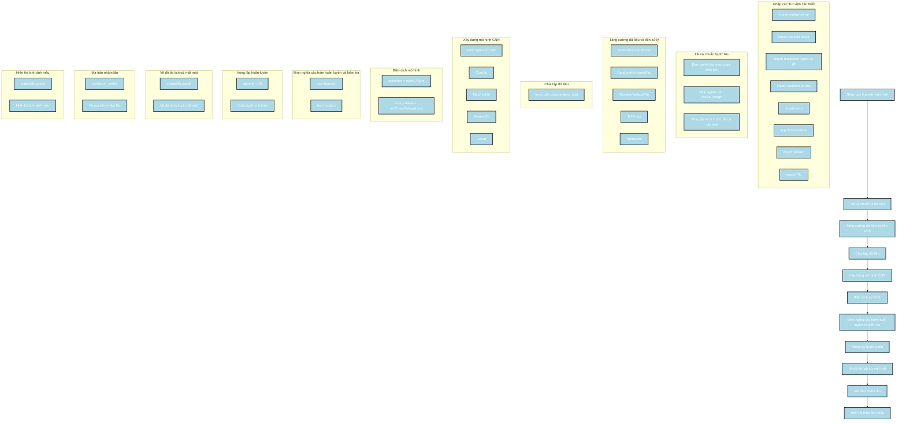

Dưới đây là phân tích về cách xây dựng mô hình của tác giả từ đoạn code được cung cấp, kèm theo sơ đồ Mermaid mô tả các bước thực hiện:

### Các bước thực hiện

1. **Nhập các thư viện cần thiết**:
   - Import các thư viện cần thiết như `numpy`, `pandas`, `matplotlib`, `torch`, `torchvision`, `sklearn`, và `PIL`.

2. **Tải và chuẩn bị dữ liệu**:
   - Định nghĩa các thư mục chứa hình ảnh của các loại bệnh khác nhau.
   - Định nghĩa hàm để thay đổi kích thước ảnh và thực hiện việc thay đổi kích thước cho tất cả các ảnh trong tập dữ liệu.

3. **Tăng cường dữ liệu và tiền xử lý**:
   - Sử dụng `torchvision.transforms` để thực hiện các phép biến đổi dữ liệu như lật ngẫu nhiên, chuyển đổi sang tensor và chuẩn hóa.

4. **Chia tập dữ liệu**:
   - Sử dụng `torch.utils.data.random_split` để chia tập dữ liệu thành tập huấn luyện và tập kiểm tra.

5. **Xây dựng mô hình CNN**:
   - Định nghĩa kiến trúc của mô hình CNN bằng cách sử dụng các lớp `Conv2d`, `MaxPool2d`, `Dropout2d`, và `Linear`.

6. **Biên dịch mô hình**:
   - Định nghĩa bộ tối ưu `Adam` và hàm mất mát `CrossEntropyLoss`.

7. **Định nghĩa các hàm huấn luyện và kiểm tra**:
   - Viết các hàm để huấn luyện và kiểm tra mô hình.

8. **Vòng lặp huấn luyện**:
   - Sử dụng vòng lặp để huấn luyện mô hình trong một số epoch xác định.

9. **Vẽ đồ thị lịch sử mất mát**:
   - Sử dụng `matplotlib` để vẽ đồ thị lịch sử mất mát trong quá trình huấn luyện và kiểm tra.

10. **Ma trận nhầm lẫn**:
    - Tính toán và vẽ ma trận nhầm lẫn để đánh giá hiệu suất của mô hình.

11. **Hiển thị hình ảnh mẫu**:
    - Hiển thị một số hình ảnh mẫu từ tập dữ liệu.

### Sơ đồ Mermaid

### Mô tả sơ đồ

1. **Nhập các thư viện cần thiết**:
   - Nhập các thư viện cần thiết như `numpy`, `pandas`, `matplotlib`, `torch`, `torchvision`, `sklearn`, và `PIL`.

2. **Tải và chuẩn bị dữ liệu**:
   - Định nghĩa các thư mục chứa hình ảnh của các loại bệnh khác nhau.
   - Định nghĩa hàm để thay đổi kích thước ảnh và thực hiện việc thay đổi kích thước cho tất cả các ảnh trong tập dữ liệu.

3. **Tăng cường dữ liệu và tiền xử lý**:
   - Sử dụng `torchvision.transforms` để thực hiện các phép biến đổi dữ liệu như lật ngẫu nhiên, chuyển đổi sang tensor và chuẩn hóa.

4. **Chia tập dữ liệu**:
   - Sử dụng `torch.utils.data.random_split` để chia tập dữ liệu thành tập huấn luyện và tập kiểm tra.

5. **Xây dựng mô hình CNN**:
   - Định nghĩa kiến trúc của mô hình CNN bằng cách sử dụng các lớp `Conv2d`, `MaxPool2d`, `Dropout2d`, và `Linear`.

6. **Biên dịch mô hình**:
   - Định nghĩa bộ tối ưu `Adam` và hàm mất mát `CrossEntropyLoss`.

7. **Định nghĩa các hàm huấn luyện và kiểm tra**:
   - Viết các hàm để huấn luyện và kiểm tra mô hình.

8. **Vòng lặp huấn luyện**:
   - Sử dụng vòng lặp để huấn luyện mô hình trong một số epoch xác định.

9. **Vẽ đồ thị lịch sử mất mát**:
   - Sử dụng `matplotlib` để vẽ đồ thị lịch sử mất mát trong quá trình huấn luyện và kiểm tra.

10. **Ma trận nhầm lẫn**:
    - Tính toán và vẽ ma trận nhầm lẫn để đánh giá hiệu suất của mô hình.

11. **Hiển thị hình ảnh mẫu**:
    - Hiển thị một số hình ảnh mẫu từ tập dữ liệu.

Sơ đồ này mô tả chi tiết các bước trong quá trình xây dựng và huấn luyện mô hình CNN của tác giả, giúp bạn dễ dàng theo dõi và hiểu được quy trình thực hiện.