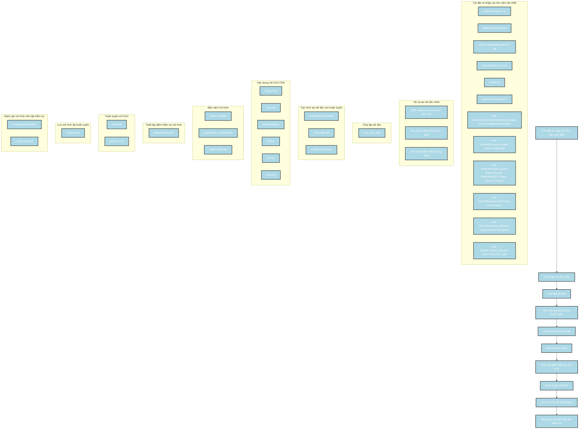

Dưới đây là phân tích về cách xây dựng mô hình của tác giả từ đoạn code được cung cấp, kèm theo sơ đồ Mermaid mô tả các bước thực hiện:

### Các bước thực hiện

1. **Cài đặt và nhập các thư viện cần thiết**:
   - Import các thư viện cần thiết như `numpy`, `pandas`, `matplotlib`, `seaborn`, `tensorflow`, `sklearn`, và các module từ `tensorflow.keras`.

2. **Tải và tạo dữ liệu nhãn**:
   - Định nghĩa thư mục chứa hình ảnh của các loại bệnh khác nhau.
   - Tạo danh sách đường dẫn ảnh và nhãn tương ứng cho từng loại ảnh.

3. **Chia tập dữ liệu**:
   - Sử dụng `train_test_split` để chia tập dữ liệu thành tập huấn luyện và tập kiểm tra.

4. **Tạo trình tạo dữ liệu cho huấn luyện**:
   - Sử dụng `ImageDataGenerator` để tạo trình tạo dữ liệu với các phép biến đổi và chuẩn hóa dữ liệu.

5. **Xây dựng mô hình CNN**:
   - Sử dụng `Sequential` để xây dựng mô hình CNN với các lớp `Conv2D`, `MaxPooling2D`, `Flatten`, `Dense`, và `Dropout`.

6. **Biên dịch mô hình**:
   - Sử dụng `model.compile` với hàm mất mát `categorical_crossentropy` và bộ tối ưu `Adam`.

7. **Thiết lập điểm kiểm tra mô hình**:
   - Sử dụng `ModelCheckpoint` để lưu lại mô hình tốt nhất trong quá trình huấn luyện.

8. **Huấn luyện mô hình**:
   - Sử dụng `model.fit` để huấn luyện mô hình trên tập dữ liệu trong số epoch xác định.

9. **Lưu mô hình đã huấn luyện**:
   - Lưu mô hình đã được huấn luyện thành tệp.

10. **Đánh giá mô hình trên tập kiểm tra**:
    - Sử dụng `model.evaluate` để đánh giá mô hình trên tập kiểm tra.

### Sơ đồ Mermaid

### Mô tả sơ đồ

1. **Cài đặt và nhập các thư viện cần thiết**:
   - Nhập các thư viện cần thiết như `numpy`, `pandas`, `matplotlib`, `seaborn`, `tensorflow`, `sklearn`, và các module từ `tensorflow.keras`.

2. **Tải và tạo dữ liệu nhãn**:
   - Định nghĩa thư mục chứa hình ảnh của các loại bệnh khác nhau.
   - Tạo danh sách đường dẫn ảnh và nhãn tương ứng cho từng loại ảnh.

3. **Chia tập dữ liệu**:
   - Sử dụng `train_test_split` để chia tập dữ liệu thành tập huấn luyện và tập kiểm tra.

4. **Tạo trình tạo dữ liệu cho huấn luyện**:
   - Sử dụng `ImageDataGenerator` để tạo trình tạo dữ liệu với các phép biến đổi và chuẩn hóa dữ liệu.

5. **Xây dựng mô hình CNN**:
   - Sử dụng `Sequential` để xây dựng mô hình CNN với các lớp `Conv2D`, `MaxPooling2D`, `Flatten`, `Dense`, và `Dropout`.

6. **Biên dịch mô hình**:
   - Sử dụng `model.compile` với hàm mất mát `categorical_crossentropy` và bộ tối ưu `Adam`.

7. **Thiết lập điểm kiểm tra mô hình**:
   - Sử dụng `ModelCheckpoint` để lưu lại mô hình tốt nhất trong quá trình huấn luyện.

8. **Huấn luyện mô hình**:
   - Sử dụng `model.fit` để huấn luyện mô hình trên tập dữ liệu trong số epoch xác định.

9. **Lưu mô hình đã huấn luyện**:
   - Lưu mô hình đã được huấn luyện thành tệp.

10. **Đánh giá mô hình trên tập kiểm tra**:
    - Sử dụng `model.evaluate` để đánh giá mô hình trên tập kiểm tra.

Sơ đồ này mô tả chi tiết các bước trong quá trình xây dựng và huấn luyện mô hình CNN của tác giả, giúp bạn dễ dàng theo dõi và hiểu được quy trình thực hiện.