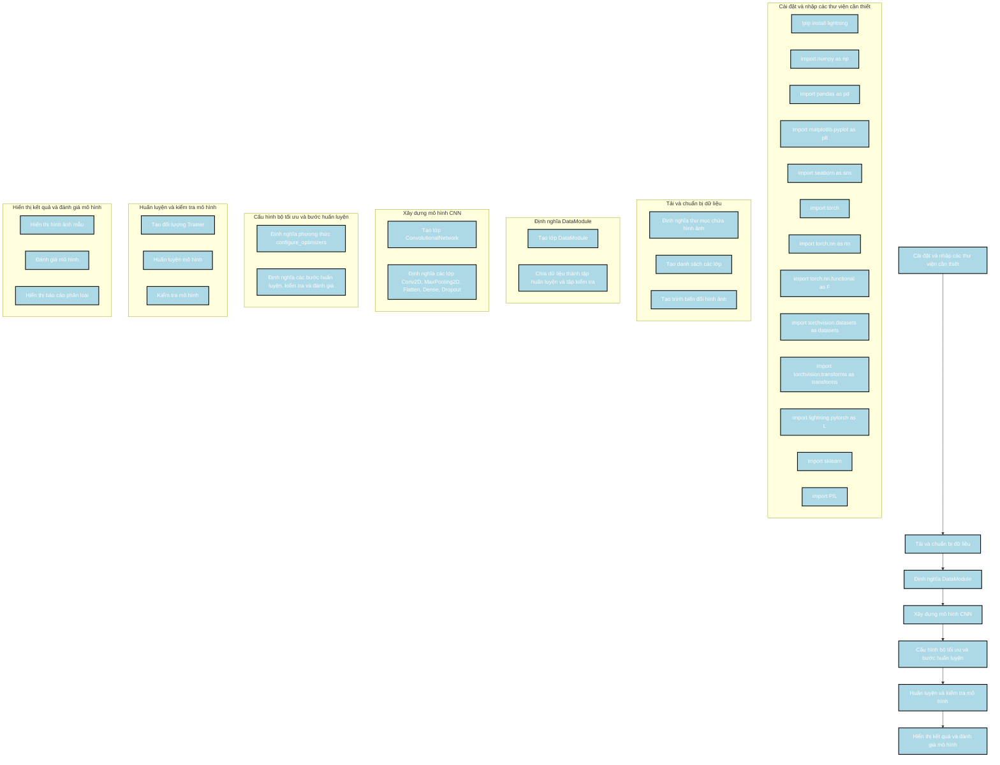

Dưới đây là phân tích về cách xây dựng mô hình từ đoạn code được cung cấp, kèm theo sơ đồ Mermaid mô tả các bước thực hiện.

### Các bước thực hiện

1. **Cài đặt và nhập các thư viện cần thiết**:
   - Cài đặt và nhập các thư viện như `numpy`, `pandas`, `matplotlib`, `seaborn`, `torch`, `torchvision`, `sklearn`, `PIL`, và các module từ `lightning.pytorch`.

2. **Tải và chuẩn bị dữ liệu**:
   - Định nghĩa thư mục chứa hình ảnh và tạo danh sách các lớp.
   - Tạo trình biến đổi hình ảnh với các phép biến đổi như xoay ngẫu nhiên, lật ngang, thay đổi kích thước và chuẩn hóa.

3. **Định nghĩa DataModule**:
   - Tạo lớp `DataModule` kế thừa từ `LightningDataModule` để quản lý dữ liệu huấn luyện và kiểm tra.
   - Chia dữ liệu thành tập huấn luyện và tập kiểm tra.

4. **Xây dựng mô hình CNN**:
   - Tạo lớp `ConvolutionalNetwork` kế thừa từ `LightningModule` với các lớp `Conv2D`, `MaxPooling2D`, `Flatten`, `Dense`, và `Dropout`.

5. **Cấu hình bộ tối ưu và bước huấn luyện**:
   - Định nghĩa phương thức `configure_optimizers` để sử dụng bộ tối ưu Adam.
   - Định nghĩa các bước huấn luyện, kiểm tra và đánh giá.

6. **Huấn luyện và kiểm tra mô hình**:
   - Tạo đối tượng `Trainer` và sử dụng nó để huấn luyện và kiểm tra mô hình.

7. **Hiển thị kết quả và đánh giá mô hình**:
   - Hiển thị một số hình ảnh mẫu từ tập huấn luyện.
   - Đánh giá mô hình trên tập kiểm tra và hiển thị báo cáo phân loại.

### Sơ đồ Mermaid

### Mô tả sơ đồ

1. **Cài đặt và nhập các thư viện cần thiết**:
   - Cài đặt và nhập các thư viện cần thiết như `numpy`, `pandas`, `matplotlib`, `seaborn`, `torch`, `torchvision`, `sklearn`, `PIL`, và các module từ `lightning.pytorch`.

2. **Tải và chuẩn bị dữ liệu**:
   - Định nghĩa thư mục chứa hình ảnh và tạo danh sách các lớp.
   - Tạo trình biến đổi hình ảnh với các phép biến đổi như xoay ngẫu nhiên, lật ngang, thay đổi kích thước và chuẩn hóa.

3. **Định nghĩa DataModule**:
   - Tạo lớp `DataModule` kế thừa từ `LightningDataModule` để quản lý dữ liệu huấn luyện và kiểm tra.
   - Chia dữ liệu thành tập huấn luyện và tập kiểm tra.

4. **Xây dựng mô hình CNN**:
   - Tạo lớp `ConvolutionalNetwork` kế thừa từ `LightningModule` với các lớp `Conv2D`, `MaxPooling2D`, `Flatten`, `Dense`, và `Dropout`.

5. **Cấu hình bộ tối ưu và bước huấn luyện**:
   - Định nghĩa phương thức `configure_optimizers` để sử dụng bộ tối ưu Adam.
   - Định nghĩa các bước huấn luyện, kiểm tra và đánh giá.

6. **Huấn luyện và kiểm tra mô hình**:
   - Tạo đối tượng `Trainer` và sử dụng nó để huấn luyện và kiểm tra mô hình.

7. **Hiển thị kết quả và đánh giá mô hình**:
   - Hiển thị một số hình ảnh mẫu từ tập huấn luyện.
   - Đánh giá mô hình trên tập kiểm tra và hiển thị báo cáo phân loại.

Sơ đồ này mô tả chi tiết các bước trong quá trình xây dựng và huấn luyện mô hình CNN với Pytorch Lightning, giúp bạn dễ dàng theo dõi và hiểu được quy trình thực hiện.