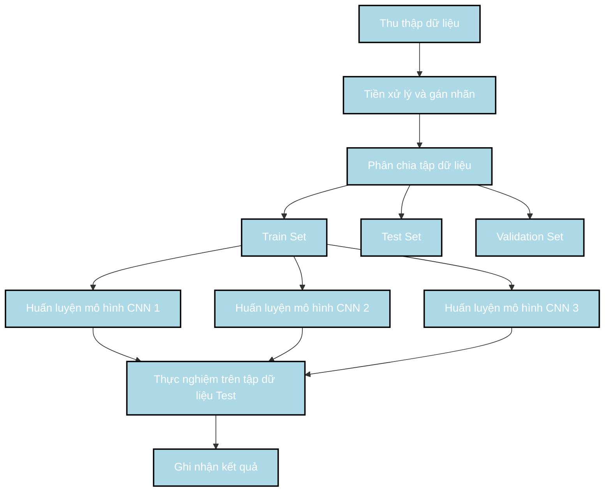
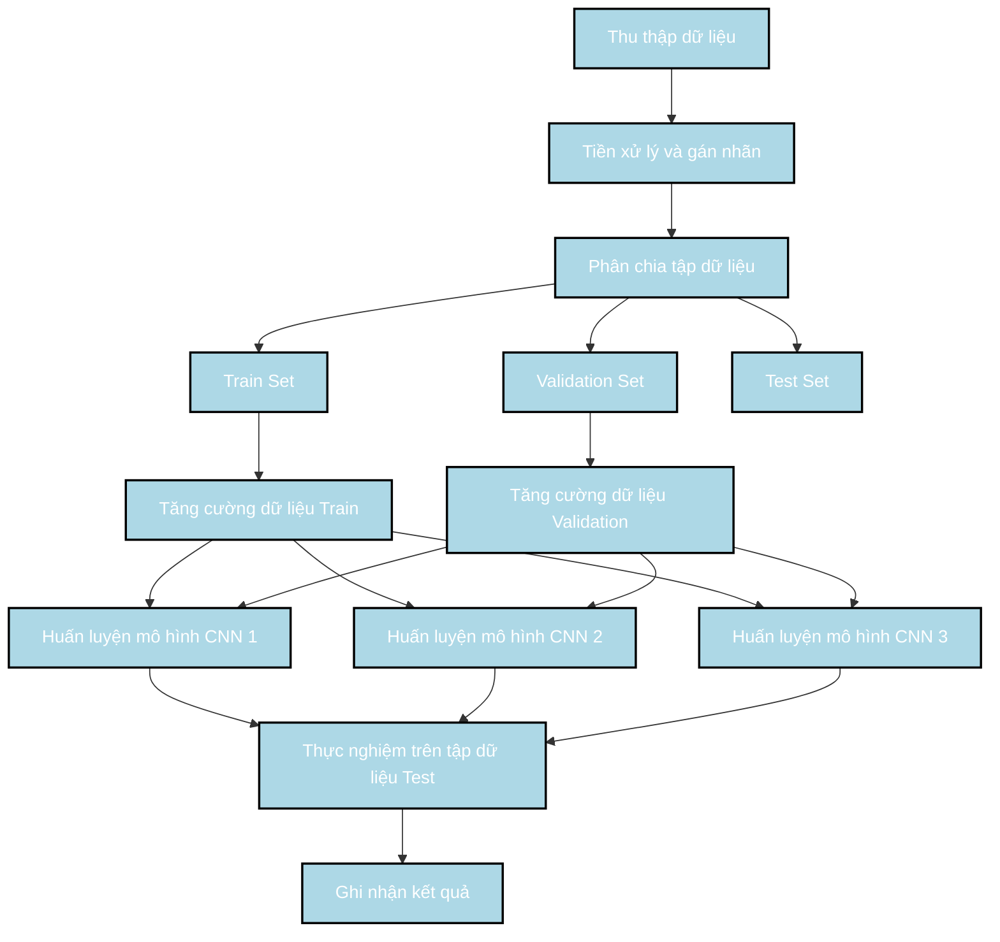
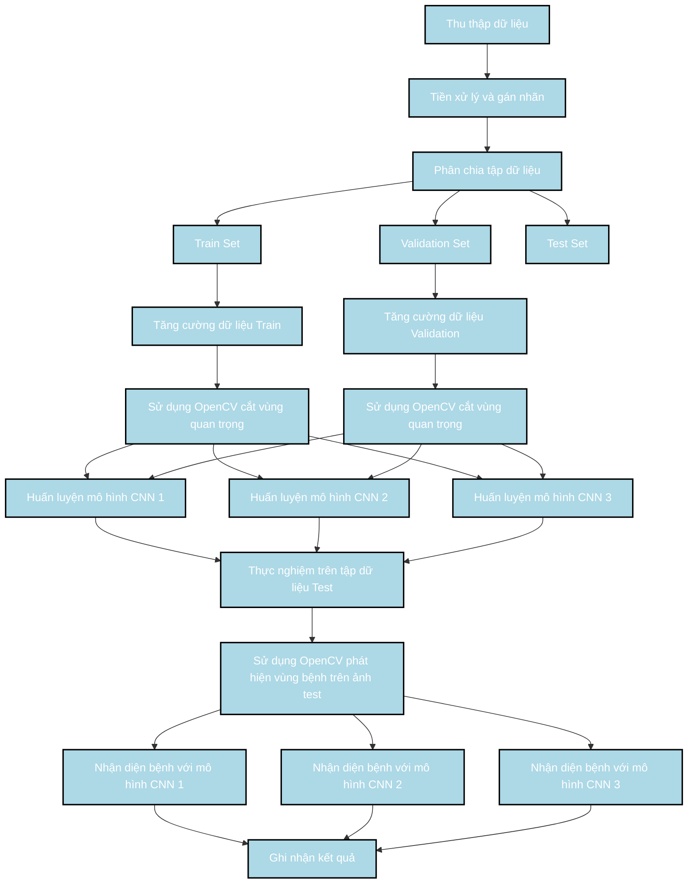
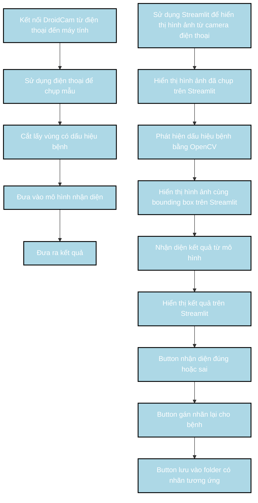

### Phương pháp 1:

### Phương pháp 2:

### Phương pháp 3:

### Demo

Sơ đồ này mô tả các bước triển khai demo cho việc nhận diện bệnh trên xoài, từ kết nối DroidCam, chụp ảnh, cắt vùng có dấu hiệu bệnh, đưa vào mô hình nhận diện và hiển thị kết quả trên Streamlit. Các bước được liên kết một cách tuần tự và logic để dễ dàng theo dõi và triển khai. Các button trên Streamlit cho phép gán nhãn lại cho bệnh và lưu vào folder tương ứng, hỗ trợ việc cải thiện dữ liệu và mô hình nhận diện.